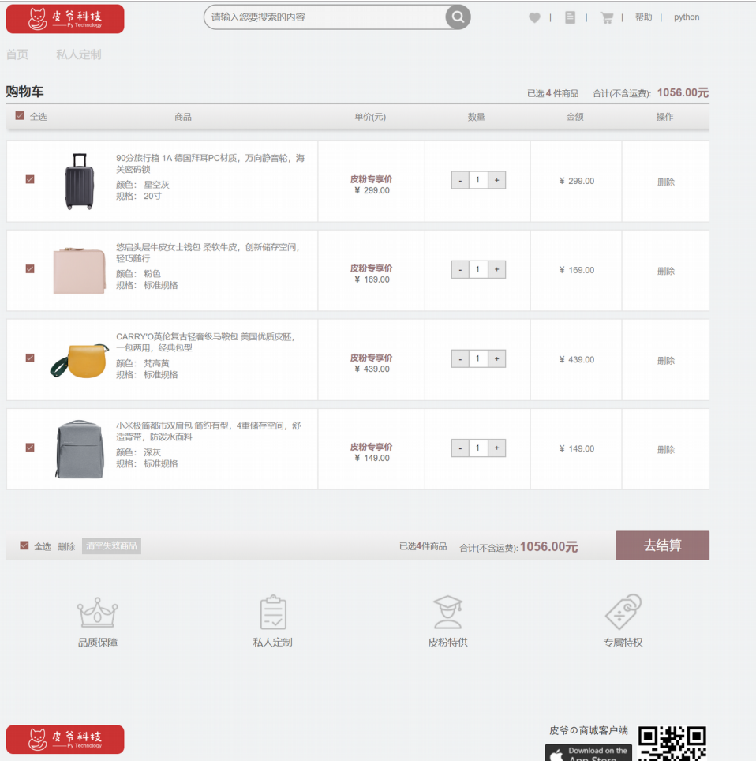

Web_cart
==========================

| Python 项目 |
| --- |
| Author：马三平|
| Date：2019-7-04|
| Existing skills:web基础 css js html5
                
-----------

[TOC]

### 功能说明

>实现网页基本结构:

    1.页面导航:
        图片 搜索框 几个基本功能按钮和登录及帮助的超链接
    2.购物车主体:
        顶部的工具栏 商品记录展示区 
         
    
>>参考网页样式如下

